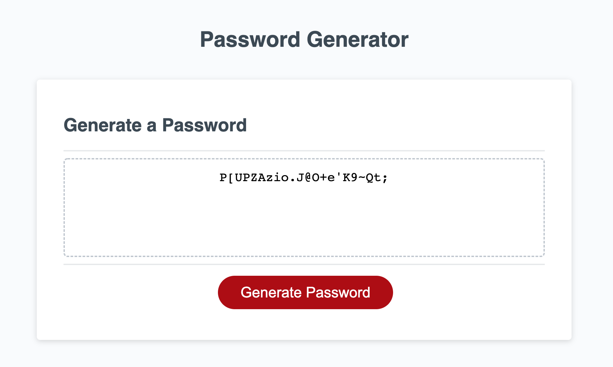

# JavaScript: Password Generator

## Description

The project is to create an application that enables employees to generate random passwords based on criteria that they’ve selected. This app will run in the browser and will feature dynamically updated HTML and CSS powered by JavaScript code. The web page has a clean and polished, responsive user interface that adapts to multiple screen sizes.

## Table of Contents
* [Installation](#installation)
* [Usage](#usage)
* [License](#license)
* [Tests](#tests)
* [Deployed Site](#deployed)
* [Contact](#contact)

## Installation 
No installation needed. 

## Usage 
The following image shows the web application's appearance and functionality:

## License 
This project is license under MIT

## Tests
There are no tests for this application.

## deployed
Code deployed at  https://jayita87.github.io/password-generator/

## Contact
If you have any questions about this projects, please contact me directly at jayita.chowdhury.1987@gmail.com. You can view more of my projects at https://github.com/jayita87.
